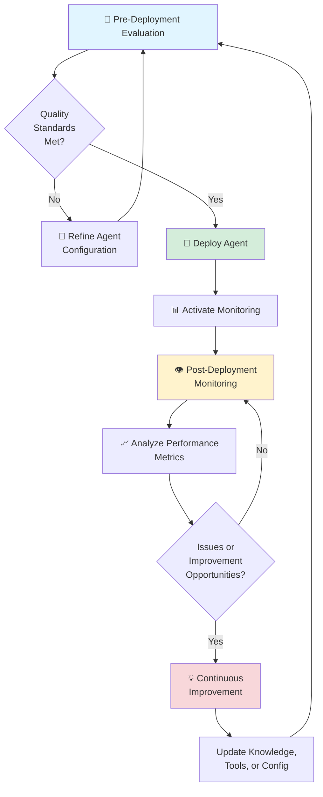

# 🛡️ Governing Agents in watsonx Orchestrate

Ensure your AI agents deliver consistent, safe, and high-quality responses through comprehensive evaluation and monitoring capabilities in watsonx Orchestrate.

## 🤔 The Problem

Meet Sarah, an AI Product Manager at a large financial services company. Her team has built several AI agents to help customer service representatives answer policy questions and process claims. However, Sarah faces a critical challenge: **How can she ensure these agents are ready for production and continue to perform well after deployment?**

Sarah's concerns are shared across industries:

- **Quality uncertainty**: Without testing, how can she know if agents will provide accurate, consistent answers to real customer questions?
- **Safety risks**: What if an agent exposes sensitive customer information (PII) or generates inappropriate content?
- **Lack of visibility**: Once deployed, how can she track agent performance and identify issues before they impact customers?
- **Cost concerns**: Token usage and API calls can add up quickly—how can she monitor and optimize costs?
- **Compliance requirements**: Her company needs audit trails and evidence of responsible AI practices for regulatory reviews

Without proper governance, Sarah's team hesitates to deploy agents at scale, fearing costly mistakes and reputational damage.

## 🎯 Objective

This add-on lab helps product managers, AI engineers, and business leaders like Sarah implement a comprehensive governance framework using watsonx Orchestrate's built-in evaluation and monitoring capabilities.

**What you'll accomplish:**

- **Test agents before deployment** using structured test cases to validate quality and safety
- **Monitor live agent performance** with real-time analytics and conversation tracking
- **Measure key quality indicators** including answer relevance, context relevance, and safety metrics
- **Track operational costs** through token usage and tool calling metrics
- **Maintain compliance** with complete audit trails of agent interactions

By completing this lab, you'll gain the confidence to deploy AI agents knowing they meet quality standards and deliver measurable business value.

## 📈 Business Value

Evaluation and monitoring in watsonx Orchestrate provide measurable insights into agent performance and safety:

- **Answer Quality**: Track answer relevance and context relevance to ensure agents provide accurate, helpful responses
- **Safety & Compliance**: Monitor for HAP (Hate, Abuse, Profanity) and PII (Personally Identifiable Information) to maintain safe, compliant interactions
- **Cost Management**: Track token usage (input/output) and tool calling metrics to optimize operational costs
- **Risk Mitigation**: Evaluate prompt safety risks before deployment to prevent harmful or inappropriate responses
- **Performance Optimization**: Use pre-deployment testing and post-deployment analytics to continuously improve agent effectiveness

These metrics enable data-driven decisions about agent quality, safety, and cost-effectiveness.

## 🏛️ Governance Workflow

The agent governance lifecycle in watsonx Orchestrate follows a continuous improvement model:

### 0. Agent Development
Before evaluating or monitoring your agent, ensure it is properly developed and configured in watsonx Orchestrate, the IBM Agentic Platform. 

### 1. Pre-Deployment Evaluation
Test your agent with structured test cases before it goes live. Upload CSV files containing user prompts and expected answers, then run evaluations to measure answer relevance, context relevance, and safety metrics. Review detailed results and iterate on your agent configuration until it meets quality standards.

### 2. Deployment
Once evaluation results meet your quality thresholds, deploy your agent with confidence. Activate monitoring to begin tracking real-world performance.

### 3. Post-Deployment Monitoring
Monitor live agent conversations through the IBM watsonx.governance dashboard. Analyzing tool, conversation, and message-level metrics, including answer relevance, token usage, HAP/PII detection, and prompt safety scores. Analyze conversation patterns to identify improvement opportunities.

### 4. Continuous Improvement
Use insights from monitoring to refine your agent. Update knowledge bases, adjust tools, or modify agent configuration based on real-world performance data. Create new test cases from problematic conversations, re-evaluate, and redeploy improved versions.

**This cycle repeats continuously**, ensuring your agents evolve and improve over time.

### Key Components

**Pre-Deployment Evaluation**
- Test case management with CSV upload
- Configurable evaluation runs (targeted or full)
- Detailed results with quality metrics
- Downloadable reports for analysis

**Post-Deployment Monitoring**
- Integration with IBM watsonx.governance
- Real-time conversation tracking
- Message-level metric analysis
- Customizable metric dashboards

**Measured Metrics**
- Answer relevance and context relevance
- Token usage (input/output)
- HAP (Hate, Abuse, Profanity) detection
- PII (Personally Identifiable Information) detection
- Prompt safety risk scores
- Tool calling performance

## 📄 Hands-on Labs

This governance add-on includes two comprehensive labs that can be completed after any of the main use case labs. You will need to have a use case agent available to run these labs:

### 0. Agent Development
This is prerequisite to running the evaluation and monitoring labs, as you will indeed need an agent to test and monitor.

**[Start the Agent Development Lab →](./ask-hr/README.md)**

### 1. Pre-Deployment Evaluation
Learn how to test your agent before it goes live using structured test cases and evaluation metrics.

**What you'll learn:**
- Creating and uploading test case CSV files
- Running targeted and full evaluations
- Interpreting evaluation results and metrics
- Iterating on agent configuration based on test results

**[Start the Evaluation Lab →](./evaluation.md)**

### 2. Post-Deployment Monitoring
Discover how to monitor your live agents' performance and gain insights from real-world interactions.

**What you'll learn:**
- Activating agent monitoring
- Accessing the watsonx.governance dashboard
- Analyzing conversation and message-level metrics
- Customizing metric views for your needs
- Using monitoring data to improve agent performance

**[Start the Monitoring Lab →](./monitoring.md)**

## 🎯 Prerequisites

Before starting these labs, you should have:
- Completed at least one of the main use case labs (e.g., AskHR, Retail, Competitive Analysis)
- A deployed or draft agent in watsonx Orchestrate
- Access to watsonx Orchestrate with evaluation and monitoring capabilities enabled

## 💡 Best Practices

**For Evaluation:**
- Create diverse test cases covering common and edge-case scenarios
- Include both positive examples (expected good responses) and negative examples (detractors)
- Run evaluations after any significant changes to tools, knowledge, or agent configuration
- Use targeted evaluations for quick validation during iterative development

**For Monitoring:**
- Enable monitoring immediately after deployment
- Review analytics regularly to identify trends and issues
- Use conversation analysis to understand real user needs and improve agent capabilities
- Track token usage to optimize costs while maintaining quality

## 📚 References

For more information on agent governance in watsonx Orchestrate, refer to the official documentation:

- [Evaluating Draft Agents](https://www.ibm.com/docs/en/watsonx/watson-orchestrate/base?topic=agents-evaluating-draft-agent)
- [Monitoring Agents](https://www.ibm.com/docs/en/watsonx/watson-orchestrate/base?topic=agents-monitoring)
- [IBM watsonx.governance](https://www.ibm.com/products/watsonx-governance)

---

> [!TIP]
> **Start with evaluation first!** Testing your agent before deployment helps you catch issues early and deploy with confidence. Once deployed, monitoring provides ongoing insights to continuously improve agent performance.
