## Table of Contents

- [Agent description](#agent-description)
- [Architecture](#architecture)
- [Pre-requisites](#pre-requisites)
- [Instructions](#instructions)
  - [Open Agent Builder](#open-agent-builder)
  - [Create HR Agent](#create-hr-agent)
  - [Test HR Agent in preview](#test-hr-agent-in-preview)
  - [Test HR Agent in AI Chat](#test-hr-agent-ai-chat)
  - [Review Domain Agents and Tools](#review-domain-agents-and-tools-optional) (Optional)
  - [Test the SAP Employee Support Manager agent](#test-the-sap-employee-support-manager-agent-optional)(Optional)

## Agent Description

This use case targets developing and deploying an AskHR agent leveraging IBM watsonx Orchestrate, as depicted in the provided architecture diagram. This agent will empower employees to interact with HR systems and access information efficiently through conversational AI. 

In this lab we will build an HR agent in watsonx Orchestrate, leveraging tools and external knowledge to connect to a simulated Human Capital Management System. This agent retrieves relevant information from documents to answer user queries and  allows users to view and manage their profiles.

## Architecture

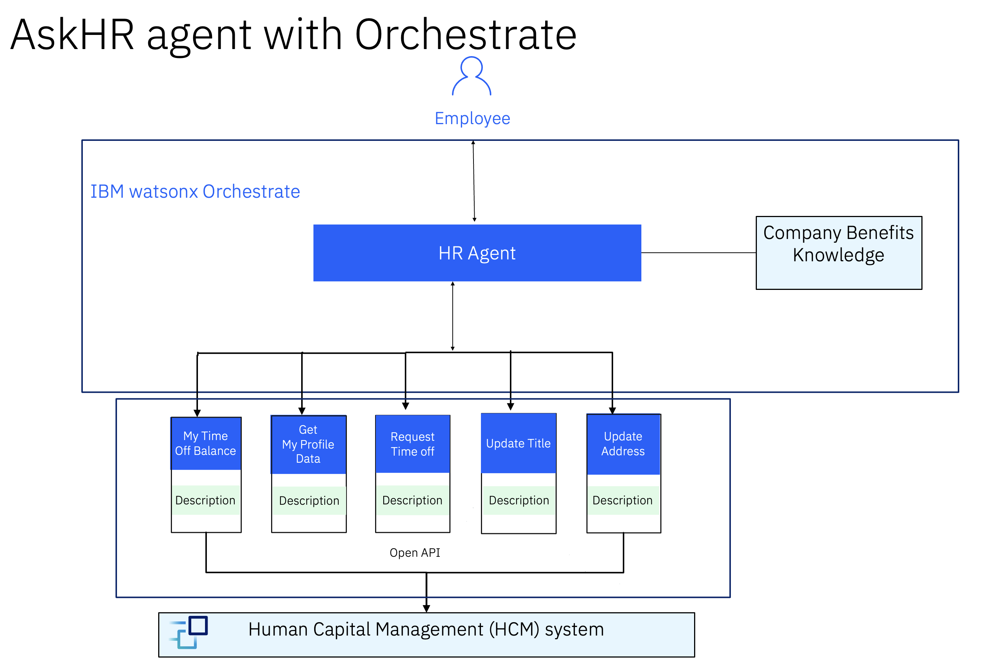


## Pre-requisites

**Participants**:
- Validate that you have access to the right TechZone environment for this lab
- Validate that you have access to the shared wxO tenant (provided by instructor) 
- Familiarity with AI agent concepts (e.g., instructions, tools, collaborators...)
- Download the following file:
  - [hr.yaml OpenAPI Spec](./assets/hr.yaml)
  
## Instructions

### Open Agent Builder

- Log in to IBM Cloud (cloud.ibm.com). Navigate to top left hamburger menu, then to Resource List. Open the AI/Machine Learning section. You should see a **watsonx Orchestrate** service, click to open.

  

- Click the "Launch watsonx Orchestrate" button.

   

- Welcome to watsonx Orchestrate. Open the hamburger menu, click on the down arrow next to **Build**.  Then click on **Agent Builder**:

   

### Create HR Agent
1. Click on **Create agent +**:

   

2. Select **Create from scratch**, give your agent a name, e.g. `HR Agent`, and fill in the **Description** as shown below: 

   ```
   You are an agent who handles employee HR queries.  You provide short and crisp responses, keeping the output to 200 words or less.  You can help users check their profile data, retrieve latest time off balance, update title or address, and request time off. You can also answer general questions about company benefits.
   ```  
   Click on **Create**:

   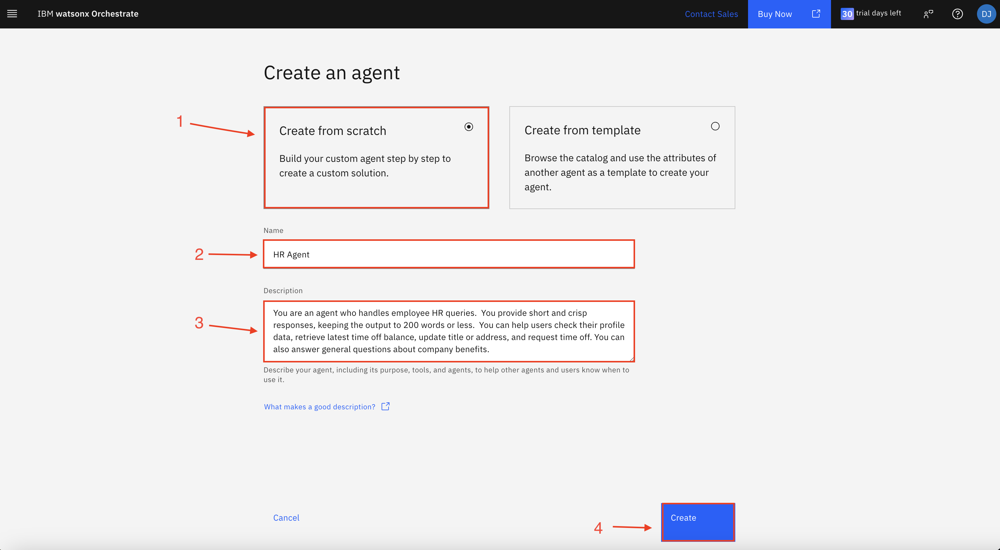

3. Select **Default** in **Agent style** section.

   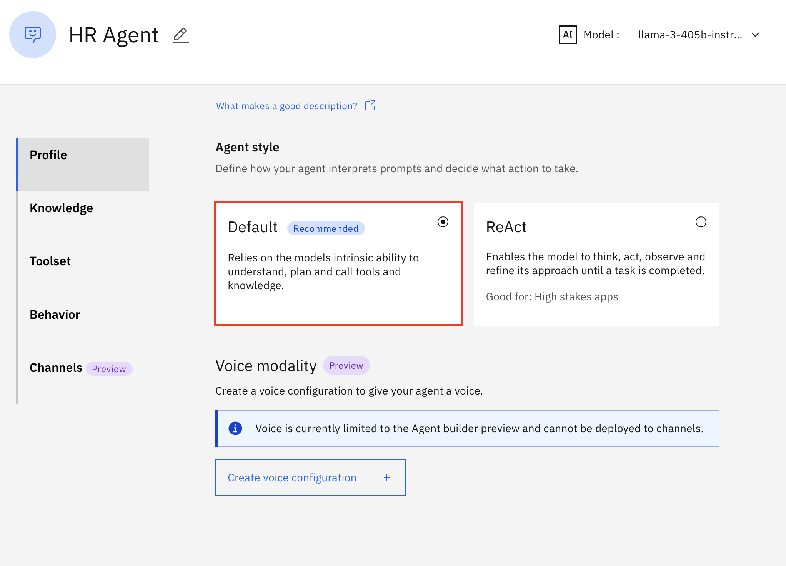
  
4. Scroll down the screen to the **Knowledge** section.
   Click on **Choose knowledge**.
   
   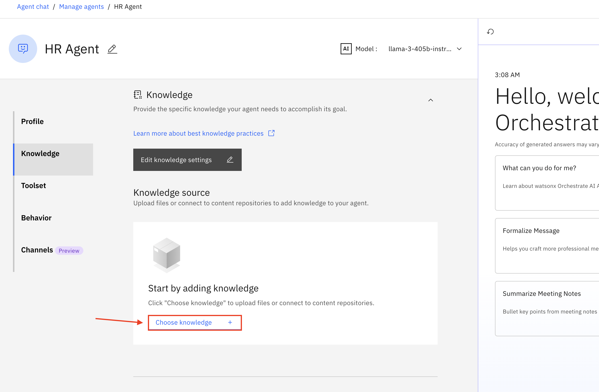
  
5. Select **Upload files**.
   Click on **Next**.
   
   
     
6. Download the [Employee Benefits.pdf](./assets/Employee-Benefits.pdf) onto your system, then upload the file here. You can download the pdf by clicking on [Employee Benefits.pdf](./assets/Employee-Benefits.pdf) and then click on download icon in opened page as shown in image below.
      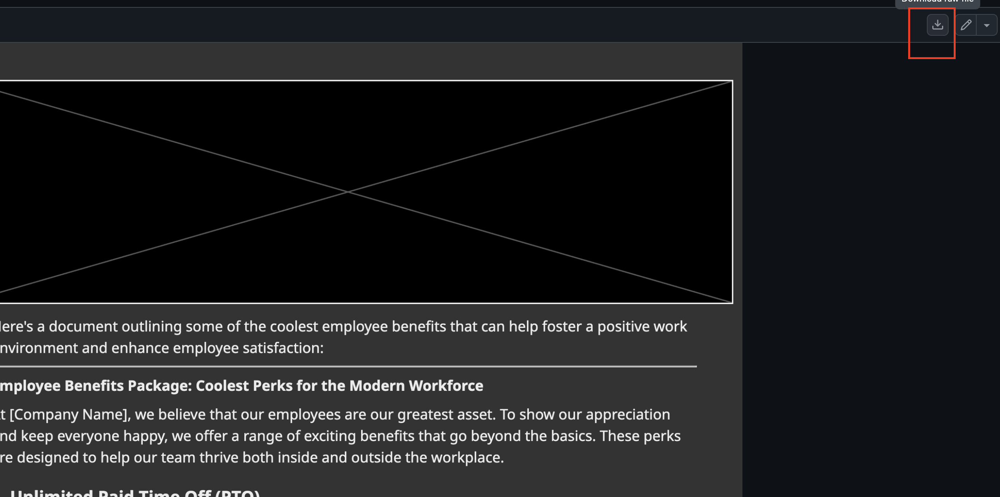

      
   Once you upload the file, Click on **Next**.

   

7. Copy the following description into the **Description** section and then click on **Save**:

   ```
   This knowledge base addresses the company's employee benefits, including parental leaves, pet policy, flexible work arrangements, and student loan repayment.
   ```
   
   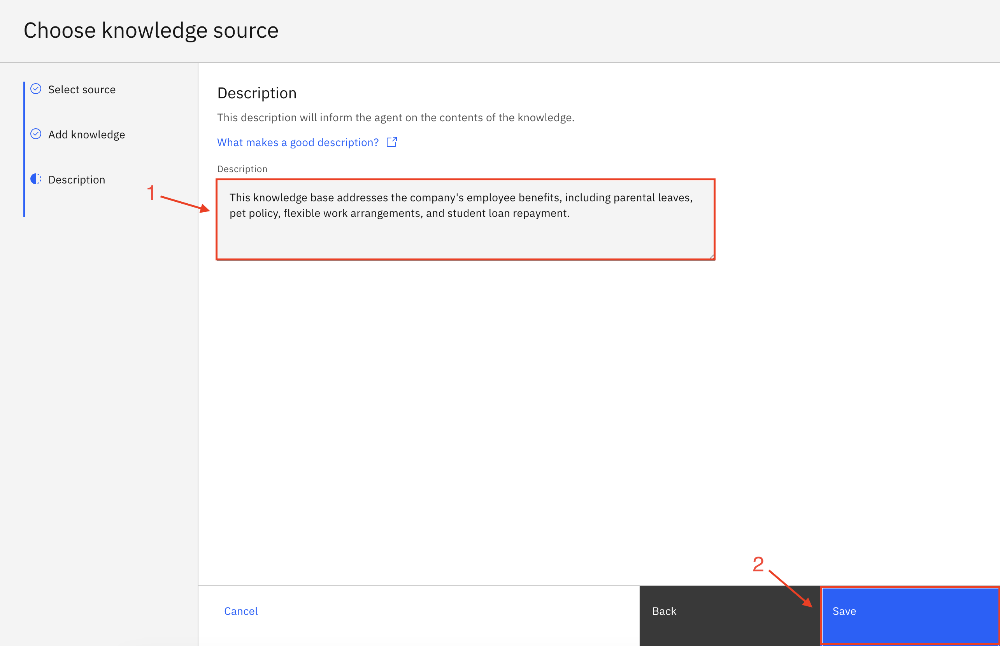

8. Scroll down to the **Toolset** section. Click on **Add tool +**:

   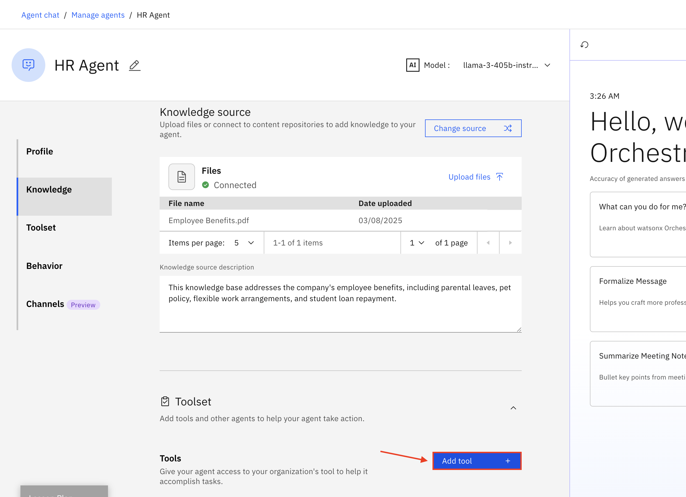

9. Select **Add from file or MCP server**:

   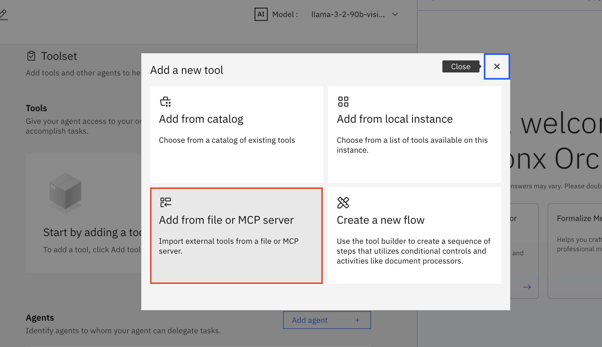

10. Select **Import from file**:

   

11. Drag and drop or click to upload the **hr.yaml** file (provided to you by the instructor), then click on **Next**:

   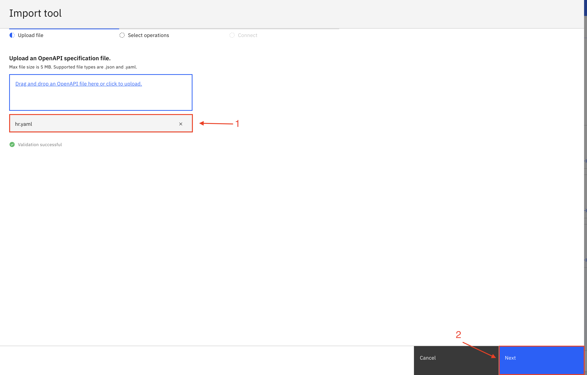    

12. Select all the operations and click on **Done**:

   

13. Scroll down to the **Behavior** section. Insert the instructions below into the **Instructions** field:

   ```
   Use your knowledge base to answer general questions about employee benefits. 

   Use the tools to get or update user specific information.

   When user asks to show profile data or check time off balance or update title/address or request time off for the very first time,  first ask the user for their name,  then invoke the tool and then use the same name in the whole session without asking for the name again.

   When the user requests time off, convert the dates to YYYY-MM-DD format, e.g. 5/22/2025 should be converted to 2025-05-22 before passing the date to the post_request_time_off tool.
   ```
14. Leave all other settings at default values and click on **Deploy** in the top right corner to deploy your agent:

   

### Test HR Agent in Preview

For this next part, first select an employee name from the list provided by your instructor and use it for your entire session.

Test your agent in the preview chat on the right side by asking the following questions and validating the responses.  They should look similar to what is shown in the screenshots below:

```
What is the pet policy? 
```


Next try the following prompts and refer to the image below for further interaction with the agent. 
Reminder: make sure to select an existing employee name from the list provided by your instructor and use the same employee for the entire session.


```
Show me my profile data.
```
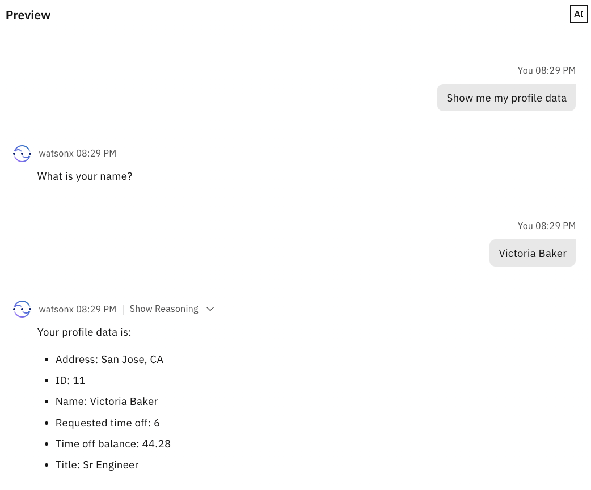

```
I'd like to update my title. 
```

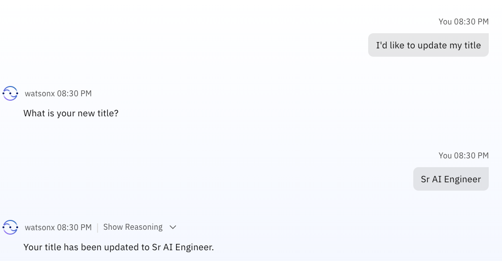

```
Update my address
```


```
What is my time off balance?
```


```
Request time off
```


```
Show my profile data.
```
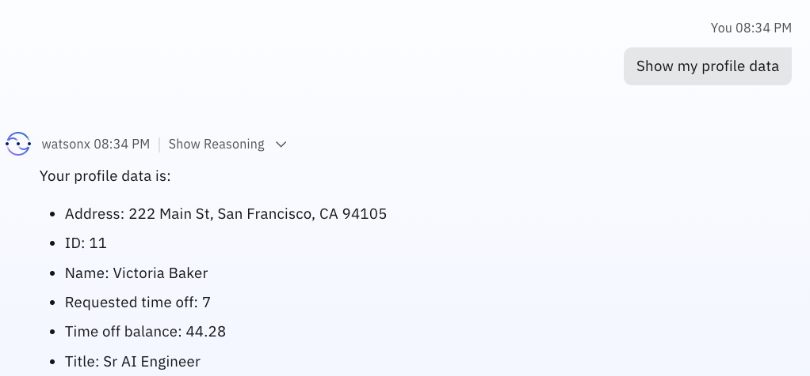

#### Test HR Agent AI Chat

Test the Agent from the AI Chat window. Click on the hamburger menu in the top left corner and then click on **Chat**:


Make sure **HR Agent** is selected. You can now test your agent:


