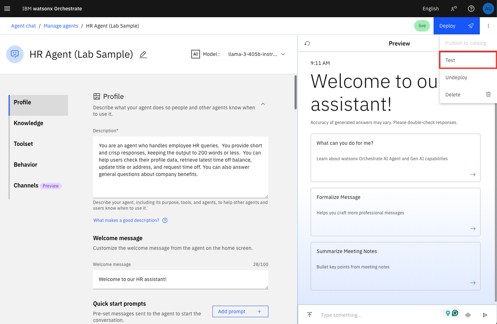
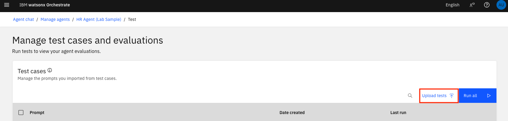
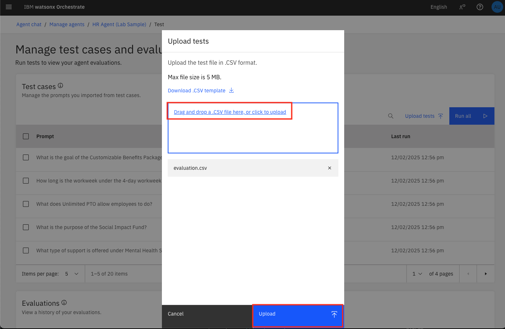
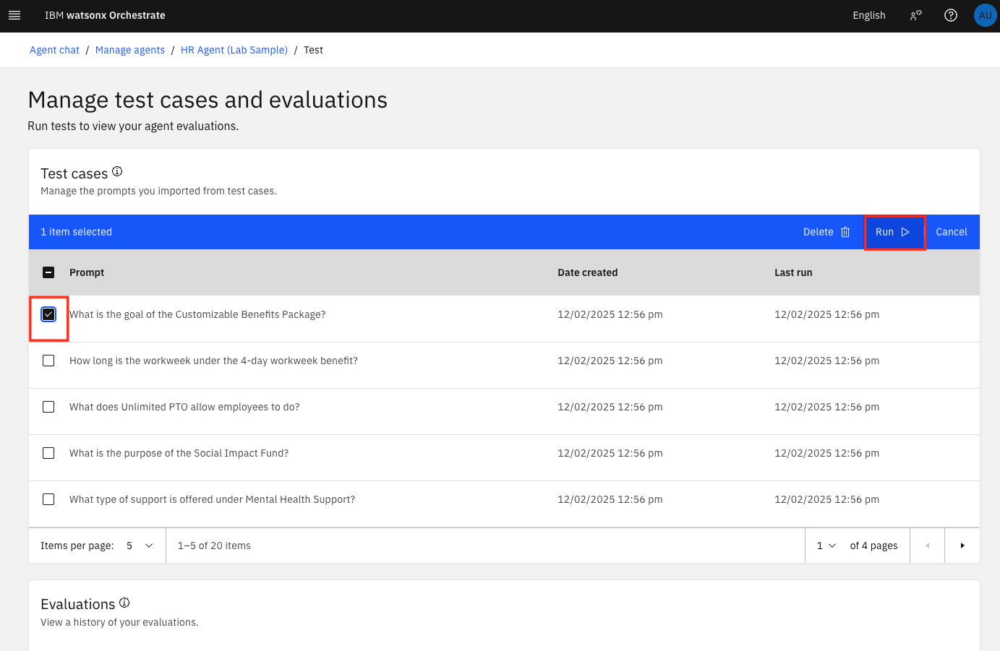
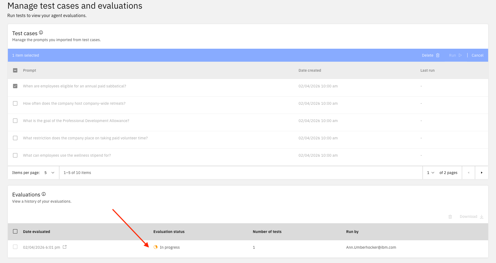
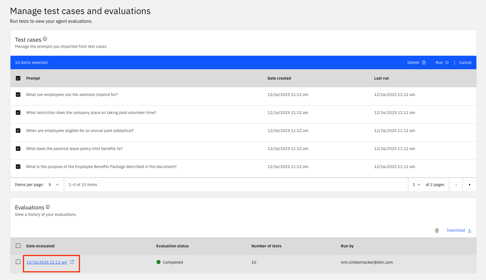
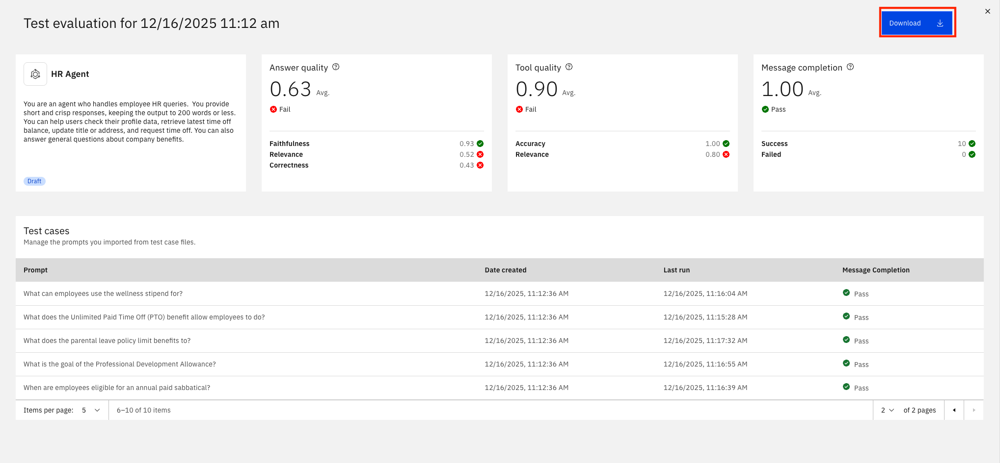

# 📊 Evaluate Agents before Deployment

Before going to production, you want to make sure that agents produce **high quality answers**. This can be done manually, but usually this is very time consuming, prone to errors, and not objective.

In this lab, you will learn how to **evaluate an AI Agent** in a more disciplined way. Testing helps confirm that recent changes to tools, collaborators, or knowledge produce the expected responses. You can iterate faster by running only relevant cases for small updates and full evaluations when validating end-to-end behavior.

Evaluating the agent before deployment helps you to fine-tune its behavior, ensuring it aligns with business goals and delivers consistent, measurable outcomes.

## 1. Prepare test cases
Before running evaluations, download the .csv file below that corresponds to your bootcamp (maximum size: 5 MB) containing test cases for your agent. 

### 1.1 Use case test files

Here are a prepared test evaluation file for your AskHR use cases. NOTE: the last 3 queries and answers are detractor responses designed to show low answer quality:

- [AskHR](ask-hr/assets/askhr-eval.csv)


### 1.2 Creating Test Files (Optional)

If you would like to download a blank template to develop your own test cases, you can click **Upload tests** > **Download CSV template** to download a sample file.

Each row in the CSV file must include one **Prompt** (the user question) and one **Answer** (the expected agent response).
This structure helps ensure that your test cases are formatted correctly and reflect realistic interaction scenarios.
Use the following format in your CSV file:

```
Prompt,Answer
"What is the capital of France?","Paris"
"List three healthcare providers.","Provider A, Provider B, Provider C"
```

You can use [watsonx.ai](https://www.ibm.com/products/watsonx-ai) prompt lab or [IBM Bob](https://www.ibm.com/products/bob) to generate your sample data.

## 2. Upload and run tests

1. Select the **Test** option from the hamburger menu on top right.



2. Select the **Upload tests** button.



3. Now, choose the link to upload your newly created test csv file, then click **Upload**.



4. Select which test Prompts you want to evaluate and click **Run**



5. While it is running the evaluation, you will see an **In progress** status



6. Once completed, you will see a green **Completed** status. You can see the test results by clicking on the completed test run.





7. You can download your results as well. 

While your evaluation is running, feel free to continue on to the [Monitoring Section](monitoring.md)


## 3. References

For more information on running evaluations, refer to the [**watsonx Orchestrate** documentation.](https://www.ibm.com/docs/en/watsonx/watson-orchestrate/base?topic=agents-evaluating-draft-agent)
