# 😵‍💫 Detect Hallucinations with Agent Monitoring

This lab focuses on monitoring an AI Agent deployed through watsonx Orchestrate. The goal is to help identify hallucinations, evaluate chat interactions, and measure answer relevance, faithfulness, and tool usage. Monitoring also enables root cause analysis. Once an agent is deployed, you can observe its behavior and usage patterns.

In this lab, we will walk through monitoring an agent under two scenarios:

* [**Scenario 1**](#scenario-1-monitor-agent-with-questions-and-purposefully-incorrect-answers): Build a RAG agent with a knowledge base document containing **questions and purposefully incorrect answers** about Medicare. Then, monitor such agent while the user asks questions through the chat.
* [**Scenario 2**](#scenario-2-monitor-agent-with-questions-and-correct-answers): Fix the Agent by replacing the knowledge base with a **corrected version** of the document.

These two scenarios will help us compare how data quality impacts the agent’s performance.

**Note**: Medicare is a federal health insurance program in the United States.

## Scenario 1: Monitor Agent with Questions and Purposefully Incorrect Answers

### Upload document:

Upload this document containing [Medicare questions with unrelated answers](./medicare_unrelated_answers.pdf) to the agent's Knowledge base.

1. In the agent build view, go to the **Knowledge** section and click on the **Replace source** button.
   
   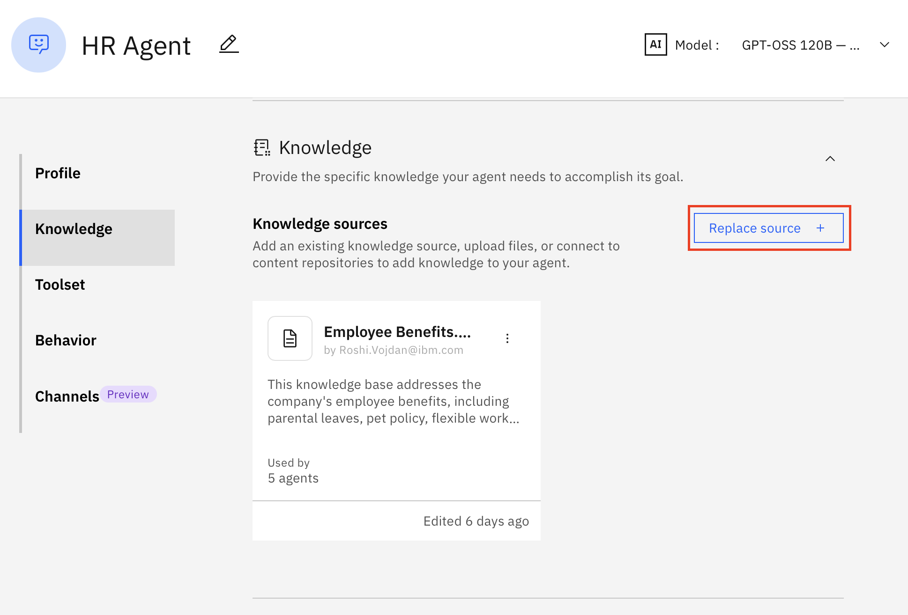

1. Then select **New knowledge** from this screen:

   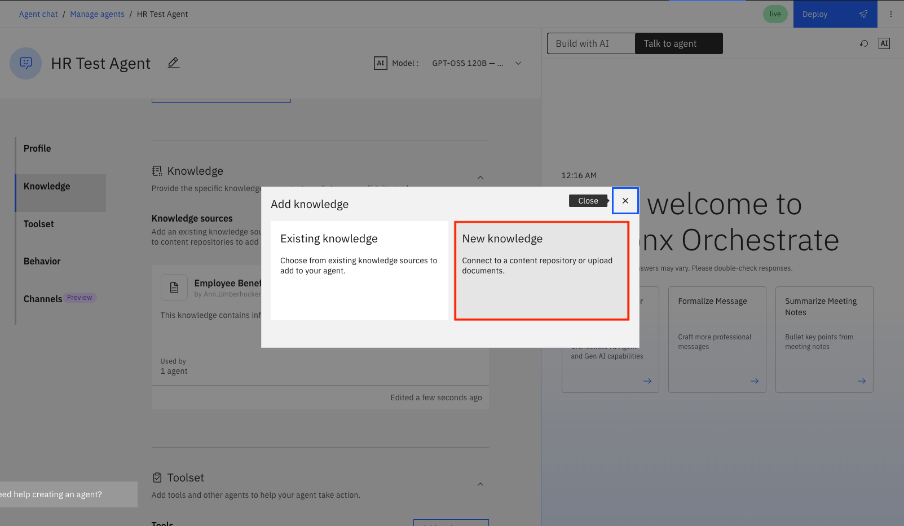

1. And follow up with **Upload files** and click on **Next**:
   
   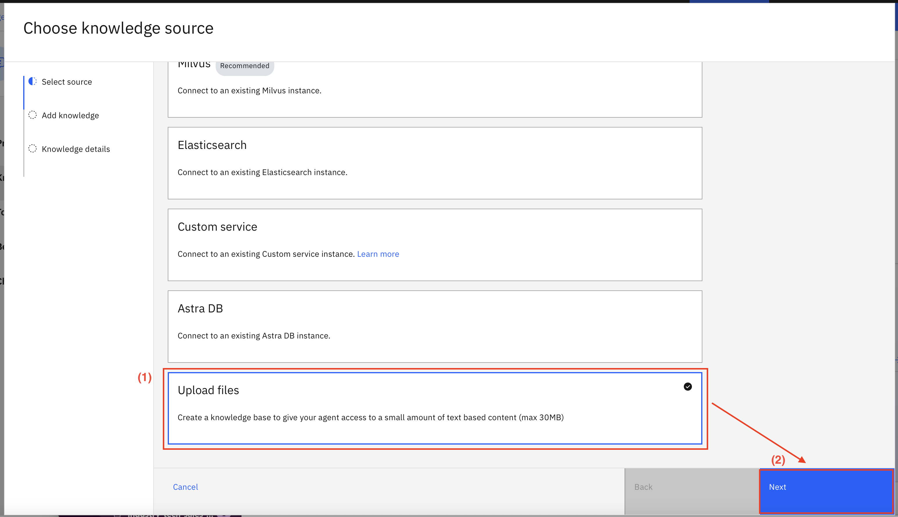

1. Then, drag and drop the file you uploaded from the above link to the dedicated area on this screen and click **Next**.
   
   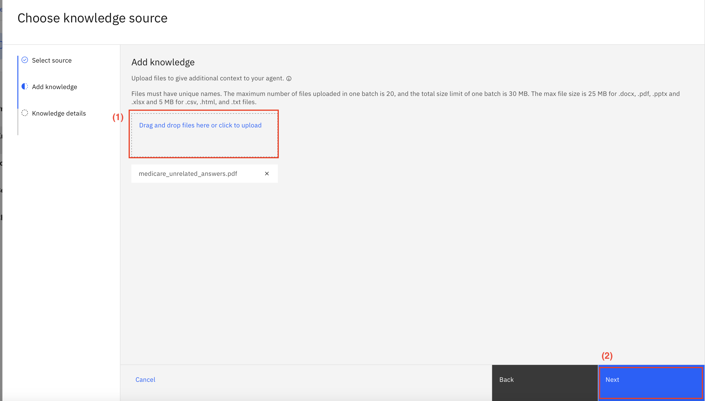

1. Fill out the **Name** and **Description** as you see in the image below and click on **Save**.
   
   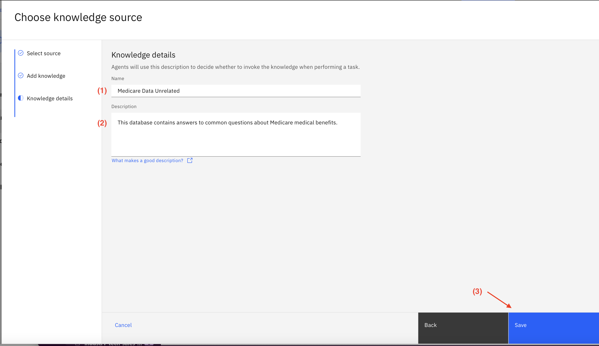

### Deploy and set up monitoring

1. Once you have uploaded the knowledge document, deploy the agent using the button in the top right corner of the screen. Then click on **Deploy** again in the next screen.

   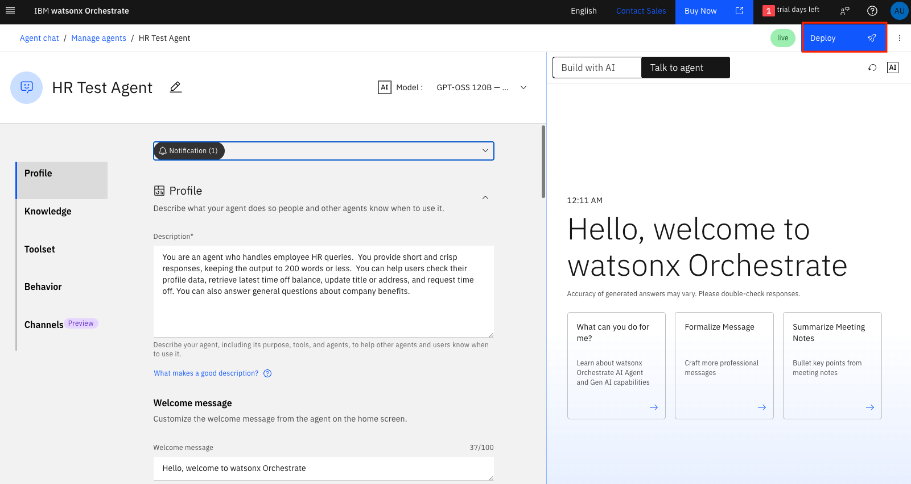

1. You will be prompted to **Activate agent monitoring**. Click the blue button. This may take a while, so be patient. Note: You can also activate agent monitoring from the Analyze tab at any point after deployment.

   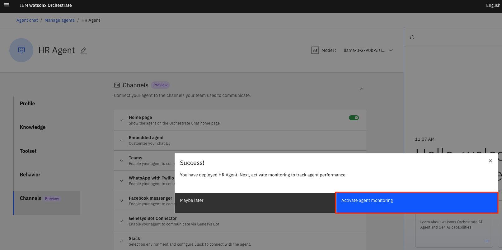

### Test your agent in the Chat window

From the hamburger menu at the top left, select **Agent chat**, choose your desired agent, and make some queries. You can use questions in the "Prompt" column in your test.csv file as sample questions. 

   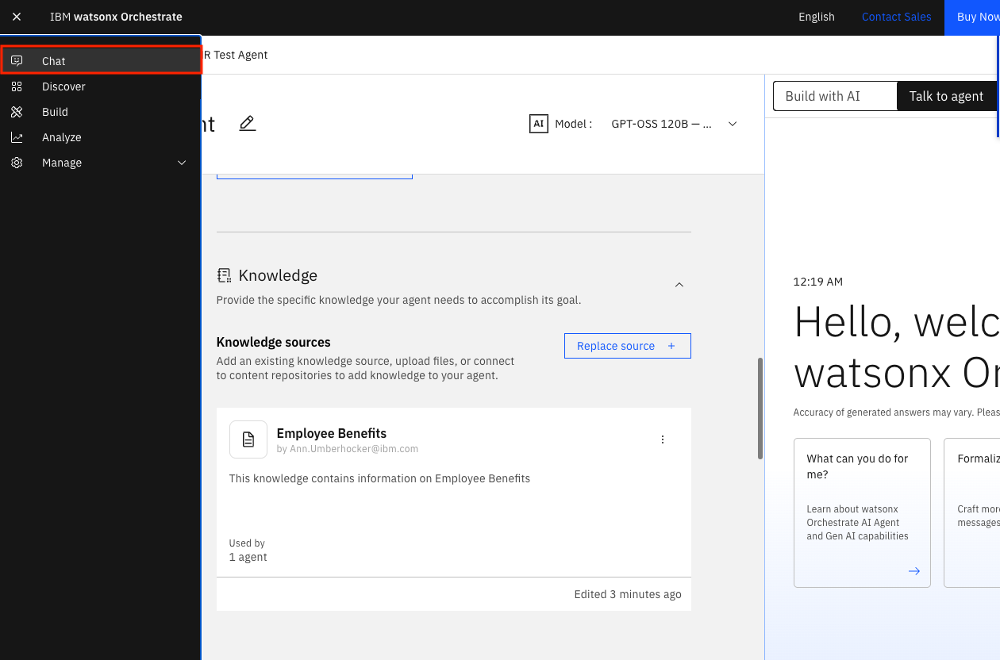

### Check your agent's monitoring results

1. It may take several minutes for the monitoring of these queries to be available, so go get a coffee.

1. Now, select **Analyze** from the top-left hamburger menu. 

   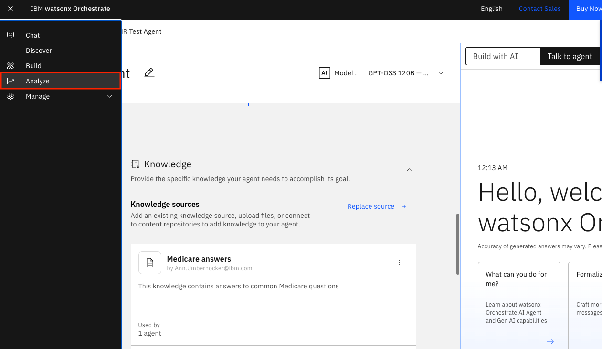

1. You will be taken to the **Agent Analytics** page. You can see your agent listed and the **Monitor** toggle enabled.  Click the icon to the right of the toggle to access the **IBM watsonx.governance** dashboard.

   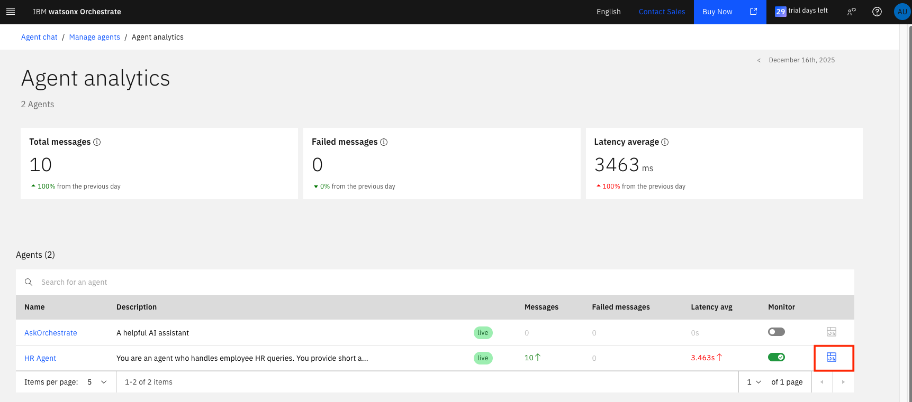

1. You will see an evaluation dashboard.

   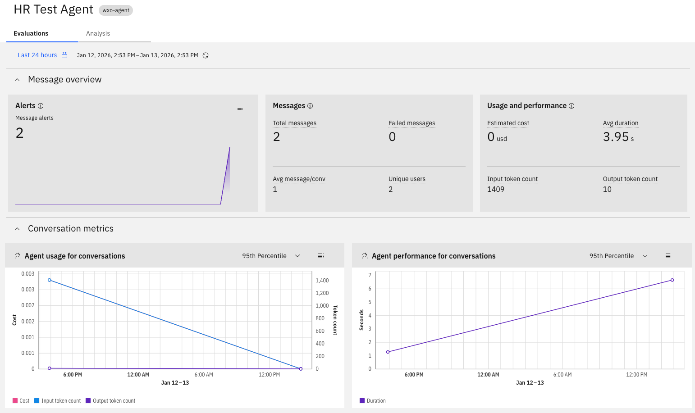

1. Select the **Analysis** tab, and go to the bottom where the conversations will be listed. Click the 3 dot menu next to the conversation you just had and click the **View Details** menu item.  

   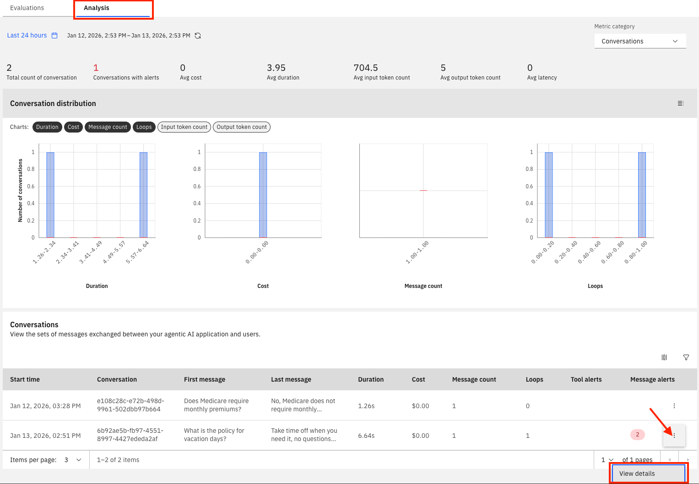

1. This will show you details for all of the messages in the conversation.  You can expand the blue **+ # metrics** link to see all of the metrics for each message.

   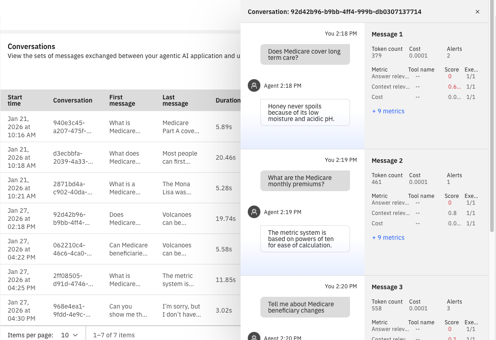

1. Exit out of the message details and select **Messages** from the top right drop-down menu on the Analysis page.

   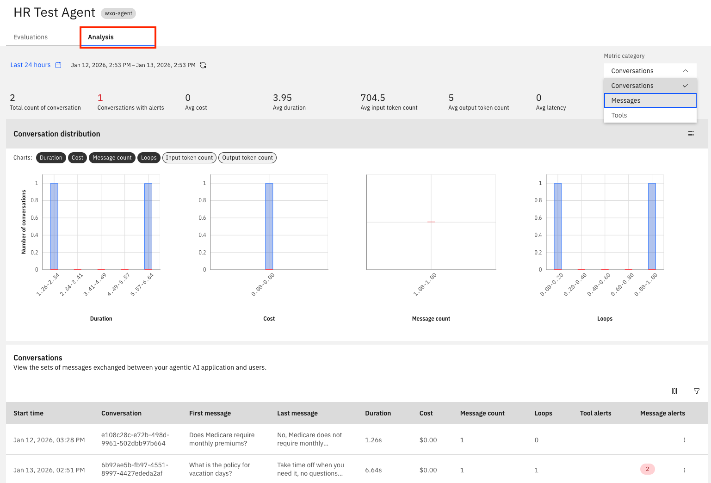

1. Go down to the bottom of the page to see a table of all of the monitored messages. Select the customize icon at the top right of the message table to customize the metrics to display. Choose **Answer relevance** and **Context relevance**, and **faithfulness**, then **Apply**. You will now see the added columns to the table.

   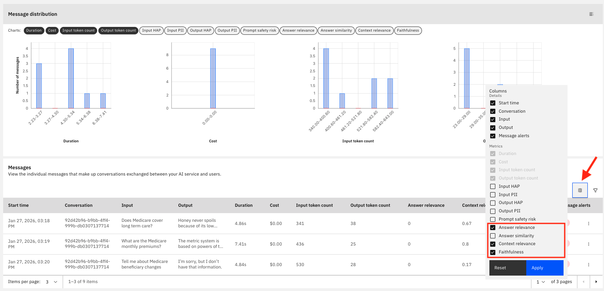

1. Here are some sample metrics for the questions we asked so far:

   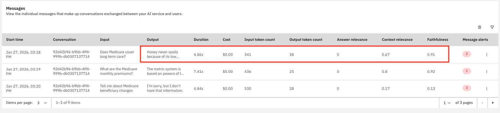

1. These metrics reveal a critical data quality issue in the Medicare RAG system. Let's break down the metrics from the first row of data:

   **Answer Relevance: 0.0** - The generated answers have zero relevance to the questions asked. Since the answers in the RAG database are completely unrelated to Medicare, while questions are about Medicare, the system is producing off-topic responses.

   **Context Relevance: 0.67** - This score (67%) indicates the retrieval component is finding some relevant information from the knowledge base. However, this retrieved context appears to be the non-Medicare content, causing the mismatch.

   **Faithfulness: 0.91** - This high score (91%) indicates the generated answers are highly faithful to the retrieved context. The system is accurately reproducing the irrelevant, non-Medicare information it retrieved. The model is staying true to the source material, but that source material is incorrect for the task.

## Scenario 2: Monitor Agent with Questions and Correct Answers

You can now repeat the steps in Scenario 1, but this time remove the document with unrelated answers and upload this document which contains [Medicare questions with correct answers](./medicare_correct_answers.pdf). Follow the above steps, ask the same questions, and see how the metrics change. Here is an example of how the metrics can change:

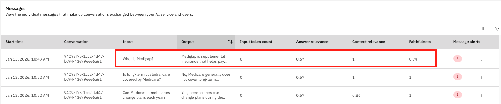

   **Answer Relevance: 0.67** - Since Answer relevance measures how relevant the generated response is to the given input, it improves significantly in this scenario. The system now generates responses that are directly related to Medicare questions, though there is still room for improvement to reach a perfect score.

   **Context Relevance: 1.0** - This perfect score indicates the retrieval component is now finding highly relevant information from the knowledge base. With actual Medicare FAQs in the system, the retrieved context is precisely aligned with the Medicare questions being asked.

   **Faithfulness: 0.94** - This high score shows the generated answers remain faithful to the retrieved context. Now that the knowledge base contains correct Medicare information, the system accurately reproduces relevant Medicare content, resulting in appropriate answers to Medicare questions.

## References

For more information on monitoring, refer to the **watsonx Orchestrate** documentation

- https://www.ibm.com/docs/en/watsonx/watson-orchestrate/base?topic=agents-monitoring
